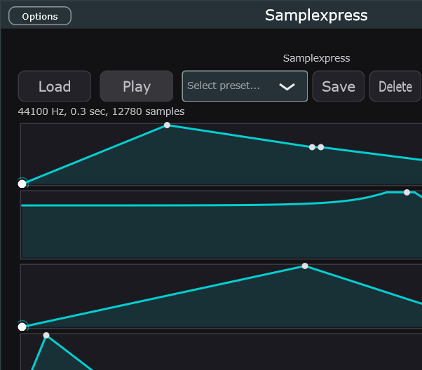

# Samplexpress

A JUCE-based sample player plugin inspired by Ableton Simpler's Classic Mode. Load a WAV or MP3, play it polyphonically across your keyboard with pitch-shifting, and shape the sound with ADSR envelopes.

## Features

- **Sample Loading** — Load WAV/MP3/AIFF via file browser or drag-and-drop onto the plugin window
- **Polyphonic Playback** — 16-voice polyphony with pitch-shifting across the full keyboard range
- **ADSR Envelopes** — Three independent envelopes for Volume, Filter Cutoff, and Pitch modulation
- **Low-Pass Filter** — State-variable TPT filter with cutoff and resonance controls
- **Spectrum Analyzer** — Real-time FFT display with frequency and dB axes
- **Presets** — Save, load, and delete named presets
- **Standalone + VST3** — Runs as a standalone app or VST3 plugin in your DAW

## Screenshots


*Main interface: sample info, ADSR displays, filter response, preset controls*


*Real-time spectrum analyzer with frequency (Hz) and amplitude (dB) axes*

## Build Requirements

- Windows 10/11 (x64)
- Visual Studio 2022 Build Tools (or full VS)
- CMake 3.22+
- Ninja build system
- JUCE 8.0.12+ (path set via `JUCE_FRAMEWORK` environment variable)

## Quick Start

### 1. Set the JUCE framework path

Run the provided PowerShell script once to persist the `JUCE_FRAMEWORK` environment variable:

```powershell
.\set-juce-framework.ps1
```

Enter the absolute path to your local JUCE installation when prompted (e.g. `C:\Users\<you>\JUCE`).

Or set it manually in an elevated PowerShell session:

```powershell
[Environment]::SetEnvironmentVariable("JUCE_FRAMEWORK", "C:\Users\<you>\JUCE", "User")
```

### 2. Build

Open a **new** Command Prompt or PowerShell window (so the variable is picked up) and run:

```powershell
# Configure
cmake -B build -G Ninja -DCMAKE_BUILD_TYPE=Release -DCMAKE_PREFIX_PATH="$env:JUCE_FRAMEWORK"

# Build
cmake --build build --config Release
```

Or use the provided convenience scripts:

```cmd
configure.bat   :: configure with Debug settings
do_build.bat    :: build after configuring
full_build.bat  :: configure + build + copy VST3
```

The build produces:
- **Standalone:** `build/Samplexpress_artefacts/Release/Standalone/Samplexpress.exe`
- **VST3:** `build/Samplexpress_artefacts/Release/VST3/Samplexpress.vst3`

## Installing

The VST3 is automatically copied to your per-user VST3 folder during build:
`%LOCALAPPDATA%\Programs\Common\VST3\Samplexpress.vst3`

No administrator privileges required.

## Tutorial

### 1. Load a Sample
Click **Load** and select a WAV or MP3 file, or drag-and-drop a file onto the plugin window.

### 2. Play the Sample
- **Standalone:** Press keys on your computer keyboard (QWERTY mapped to notes)
- **VST3:** Send MIDI from your DAW

### 3. Shape the Sound
Click and drag on the ADSR displays to adjust envelope parameters:
- **Volume ADSR** — Controls loudness over time
- **Filter ADSR** — Modulates the low-pass filter cutoff
- **Pitch ADSR** — Adds pitch variation (set Sustain to 1.0 for no effect)

Drag the **filter response curve** to adjust cutoff and resonance.

### 4. Save a Preset
Choose a preset from the dropdown, or click **Save** to store your current settings. Click **Delete** to remove a preset.

### 5. Watch the Spectrum
The spectrum analyzer shows the frequency content of your sound in real time — frequency (Hz) on the X-axis, amplitude (dB) on the Y-axis.

## Project Structure

```
Source/
  PluginProcessor.cpp/h           — Audio engine, sample playback, ADSR
  PluginEditor.cpp/h              — UI layout, component wiring
  SamplexpressVoice.cpp/h         — Per-voice sample rendering
  SamplexpressLookAndFeel.cpp/h   — Custom JUCE LookAndFeel_V4 subclass
  SpectrumAnalyzerComponent.cpp/h — FFT spectrum display
  FilterResponseComponent.cpp/h   — Interactive filter curve
  AdsrDisplayComponent.cpp/h      — Interactive ADSR graphs
  PresetManager.cpp/h             — Save/load/delete presets
```

## License

This project is built with the [JUCE framework](https://juce.com/). See JUCE licensing for distribution terms.
