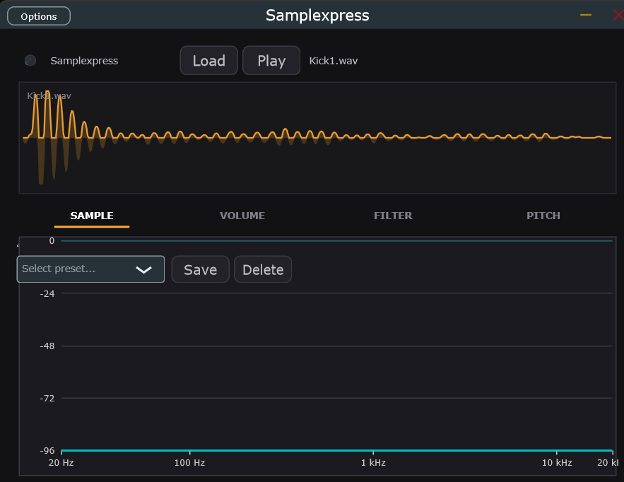

# Samplexpress

A JUCE-based sample player plugin inspired by Ableton Simpler's Classic Mode. Load a WAV or MP3, play it polyphonically across your keyboard with pitch-shifting, and shape the sound with ADSR envelopes. Ships as a VST3 plugin and a standalone Windows executable.

Current version: **v0.2.0** (Interactive UI).

## Features

- **Sample Loading** — Load WAV/MP3/AIFF via file browser or drag-and-drop onto the plugin window
- **Waveform Display with Loop Markers** — Large orange waveform visualisation of the loaded sample, with draggable loop start/end markers and a shaded loop region
- **Loop Playback with Crossfade** — Toggleable forward loop with cosine equal-power crossfade (0–500 ms); per-voice loop state cached in `startNote()` for real-time safety
- **Tab-Based Layout** — Clean, organised sections: SAMPLE, VOLUME, FILTER, and PITCH
- **Polyphonic Playback** — 16-voice polyphony with pitch-shifting across the full keyboard range
- **Three ADSR Envelopes** — Independent envelopes for Volume, Filter Cutoff, and Pitch modulation, with interactive drag-to-edit graphs, per-node tooltips ("Attack" / "Decay / Sustain" / "Release"), and live numeric readouts while dragging
- **Low-Pass Filter** — State-variable TPT filter with cutoff and resonance controls, plus an interactive magnitude-response curve you drag directly
- **Spectrum Analyzer** — Real-time FFT display (32 log-spaced bins, lock-free ring-buffer capture) visible behind every tab
- **Visual Piano Keyboard** — 2-octave on-screen keyboard (C3–B4) along the bottom of the editor that lights up in real time on MIDI note-on/off
- **Preset System** — Save, load, browse, and delete presets as XML files in `Documents/Samplexpress/Presets`; factory "Init" preset auto-created on first run
- **Title-Bar Transport & Preset Controls** — Play button, sample file name, preset ComboBox, Save, and Delete are all in the always-visible title bar (per-user VST3 install path — no admin needed)
- **Standalone + VST3** — Runs as a standalone app or as a VST3 plugin in your DAW

## Screenshots


*Main interface (v0.2): title bar with sample file, preset controls, and tab-alpha knob; SAMPLE tab with orange waveform and loop markers; visual piano keyboard along the bottom; spectrum analyser visible behind the tab content.*

## Development Process

See [docs/PROCESS-RETROSPECTIVE.md](docs/PROCESS-RETROSPECTIVE.md) for a retrospective on how this VST3 plugin was built — how the PAUL Framework structured the work, how features were described and turned into plans, and the test methodology actually run on this Windows host (versus what `CLAUDE.md` aspires to).

## Build Requirements

- Windows 10/11 (x64)
- Visual Studio 2022 Build Tools (or full Visual Studio)
- CMake 3.22+
- Ninja build system
- JUCE 8.0.12+ (path set via the `JUCE_FRAMEWORK` environment variable)

## Quick Start

### 1. Set the JUCE framework path

Run the provided PowerShell script once to persist the `JUCE_FRAMEWORK` environment variable:

```powershell
.\set-juce-framework.ps1
```

Enter the absolute path to your local JUCE installation when prompted (e.g. `C:\Users\<you>\JUCE`).

Or set it manually in an elevated PowerShell session:

```powershell
[Environment]::SetEnvironmentVariable("JUCE_FRAMEWORK", "C:\Users\<you>\JUCE", "User")
```

### 2. Build

Open a **new** Command Prompt or PowerShell window (so the variable is picked up) and run:

```powershell
# Configure
cmake -B build -G Ninja -DCMAKE_BUILD_TYPE=Release -DCMAKE_PREFIX_PATH="$env:JUCE_FRAMEWORK"

# Build
cmake --build build --config Release
```

Or use the provided convenience scripts:

```cmd
configure.bat   :: configure with Debug settings
do_build.bat    :: build after configuring
full_build.bat  :: configure + build + copy VST3
build_vst3.bat  :: build only the VST3 target (Debug)
build_kb.bat    :: build only the Standalone target (Debug)
```

The build produces:
- **Standalone:** `build/Samplexpress_artefacts/Release/Standalone/Samplexpress.exe`
- **VST3:** `build/Samplexpress_artefacts/Release/VST3/Samplexpress.vst3`

## Installing

The VST3 is automatically copied to your per-user VST3 folder during build:
`%LOCALAPPDATA%\Programs\Common\VST3\Samplexpress.vst3`

No administrator privileges required.

## Tutorial

### 1. Load a Sample
Click **Load** in the title bar and select a WAV or MP3 file, or drag-and-drop a file onto the plugin window. The waveform display shows the loaded sample with loop markers (orange vertical lines and a shaded loop region).

### 2. Play the Sample
- **VST3:** Send MIDI from your DAW — the visual piano keyboard along the bottom of the editor lights up in real time
- **Standalone:** Use the Play button in the title bar to audition the loaded sample

### 3. Shape the Sound
Click the tabs to switch between sections. The spectrum analyser is always visible in the background so you can see how your adjustments affect the sound:

- **VOLUME tab** — Click and drag the ADSR graph to adjust the loudness envelope over time. Hover a node for its tooltip; live numeric readouts appear while you drag
- **FILTER tab** — Drag the filter response curve to set cutoff and resonance; the Filter ADSR shapes how the filter opens and closes
- **PITCH tab** — Adjust the Pitch ADSR to add pitch variation (set Sustain to 1.0 for no effect)
- **SAMPLE tab** — View sample info, drag the loop markers, and toggle the loop on/off

### 4. Set Up Looping
On the **SAMPLE** tab, drag the orange loop markers on the waveform to set loop start and end points, slide the crossfade length for a smooth loop boundary, then toggle the loop on. The voice uses an equal-power cosine crossfade at the loop boundary so there are no clicks.

### 5. Save a Preset
Use the preset ComboBox, **Save**, and **Delete** controls in the title bar to store and recall full plugin state (APVTS parameters + sample). The factory "Init" preset is auto-created on first run.

### 6. Watch the Spectrum
The spectrum analyser shows the frequency content of your sound in real time behind every tab — frequency (Hz) on the X-axis, amplitude (dB) on the Y-axis. The tab-alpha knob in the title bar controls how opaque the tab content is over the spectrum.

## Project Structure

```
Source/
  PluginProcessor.cpp/h            — Audio engine, sample playback, ADSR, APVTS, state persistence
  PluginEditor.cpp/h               — UI layout, tab switching, title bar, component wiring
  SamplexpressVoice.cpp/h          — Per-voice sample rendering, pitch-shifting, loop crossfade
  SamplexpressLookAndFeel.cpp/h    — Custom JUCE LookAndFeel_V4 subclass (flat buttons, knobs)
  WaveformDisplay.cpp/h            — Orange sample waveform with loop markers
  TabBar.cpp/h                     — Horizontal tab bar with orange active indicator
  SpectrumAnalyzerComponent.cpp/h  — FFT spectrum display (32 log-spaced bins)
  FilterResponseComponent.cpp/h    — Interactive draggable filter magnitude curve
  AdsrDisplayComponent.cpp/h       — Interactive ADSR graphs with tooltips and live readouts
  VisualKeyboardComponent.cpp/h    — 2-octave on-screen piano keyboard (C3–B4)
  PresetManager.cpp/h              — Save / load / browse / delete presets (XML)
```

## License

This project is built with the [JUCE framework](https://juce.com/). See JUCE licensing for distribution terms.
